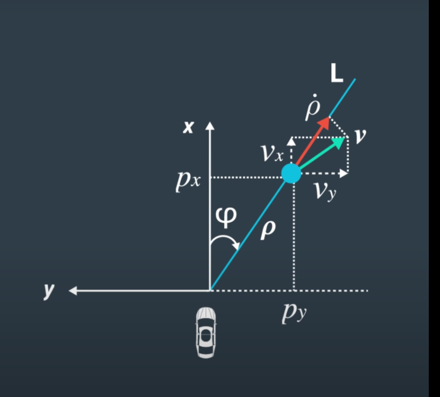
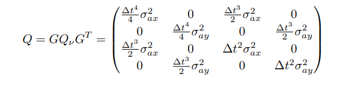
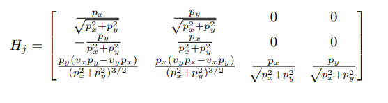

# Extended Kalman Filter Project

In this project you will utilize a kalman filter to estimate the state of a moving object of interest with noisy lidar and radar measurements. Passing the project requires obtaining RMSE values that are lower than the tolerance outlined in the project rubric. 

This project involves the Term 2 Simulator which can be downloaded [here](https://github.com/udacity/self-driving-car-sim/releases).

This repository includes two files that can be used to set up and install [uWebSocketIO](https://github.com/uWebSockets/uWebSockets) for either Linux or Mac systems. For windows you can use either Docker, VMware, or even [Windows 10 Bash on Ubuntu](https://www.howtogeek.com/249966/how-to-install-and-use-the-linux-bash-shell-on-windows-10/) to install uWebSocketIO. Please see the uWebSocketIO Starter Guide page in the classroom within the EKF Project lesson for the required version and installation scripts.

---
**Note**: I use Xcode to edit and debug this project, xcode project file is at [ide_profiles/xcode/ExtendedKF.xcodeproj](./ide_profiles/xcode/ExtendedKF.xcodeproj)

To create Xcode IDE profile please see [ide_profiles/README.md](./ide_profiles/README.md)

## Original Udacity Repo
More detailed variable descriptions and instruction, please refer to [udacity/CarND-Extended-Kalman-Filter-Project](https://github.com/udacity/CarND-Extended-Kalman-Filter-Project)


## Code Walk-through
The following logic is located in `FusionEKF.cpp`
1. Determine if everything is initialized or not
    
    If not, initialize vector `x_` inside `KalmanFilter` instance according to the sensor type:
    *  Radar: Calculate px, py, vx, vy from the measurement rho, phi, rho_dot using geometry.

      

    * Laser: The measurement only contain px and py. Only feed those into `x_[0]` and `x_[1]`

    * Record the previous time stamp from the measurement pack

    If initialized, then go to Prediction step.
  

2. Prediction

   First, calculate dt, dt^2, dt^3, dt^4 from the previous timestamp. Then create a covariance matrix of process noise  and feed into `Q_` in `KalmanFilter`

    
    
    Where σ^2ax and σ^2ay equals 9 in this case. 

    Next, call function `Predict` in `KalmanFilter` Class, where state is predicted by the state-transition matrix F
    ```c
    x_ = F_ * x_;
    MatrixXd Ft = F_.transpose();
    P_ = F_ * P_ * Ft + Q_;
    ```

3. After the prediction is made, update the Observation matrix H and the covariance of the observation noise according to the sensor type
  
  * If it is radar, H is calculate Jacobian from `x_`.

    

    And then use `UpdateEKF` from `KalmanFilter`
    ```c
    void KalmanFilter::UpdateEKF(const VectorXd &z) {
    float rho = sqrt(x_(0)*x_(0) + x_(1)*x_(1));
    float phi = atan2(x_(1), x_(0));
    float rho_dot = (x_(0)*x_(2)+x_(1)*x_(3))/rho;
    
    VectorXd H = VectorXd(3);
    H << rho,phi,rho_dot ;
    VectorXd y = z - H;
    
    // need to reduce the phi until it is within -pi and pi
    while (y(1)<-M_PI || y(1)>M_PI) {
        // if the phi is less than -pi, plus by pi until it is greater than -pi
        if (y(1)< -M_PI) {
            y(1) += M_PI;
        }
        // if the phi is greater than pi, minus by pi until it is less than pi
        else if (y(1)> M_PI){
            y(1) -= M_PI;
        }
    } 
    General_update(y);
    }
    ```

* If it is Laser, takes the pre-defined H_laser and R_laser values:
  ```c
  //measurement covariance matrix - laser
  R_laser_ << 0.0225, 0,
              0, 0.0225;
  // H as defined in the class for laser. I only need px and py for lidar reading
  H_laser_ << 1,0,0,0,
              0,1,0,0;
  ```
  And then update using `Update` in `KalmenFilter`
  ```c
  void KalmanFilter::Update(const VectorXd &z) {
    VectorXd y = z - H_ * x_;
    General_update(y);
  }

  void KalmanFilter::General_update(const VectorXd &y){
      MatrixXd Ht = H_.transpose();
      MatrixXd S = H_ * P_ * Ht + R_;
      MatrixXd Si = S.inverse();
      MatrixXd K = P_ * Ht * Si;
      // New state
      x_ = x_ + (K * y);
      
      // Define Identity matrix based on the x size
      MatrixXd I = MatrixXd::Identity(x_.size(),x_.size());
      
      P_ = (I - K * H_) * P_;    
  }
  ```


## Finial Result Video
Lidar measurements are red circles, radar measurements are blue circles with an arrow pointing in the direction of the observed angle, and estimation markers are green triangles.The video below shows what the simulator looks like when a c++ script is using its Kalman filter to track the object. The simulator provides the script the measured data (either lidar or radar), and the script feeds back the measured estimation marker, and RMSE values from its Kalman filter.
The video below is my implementation of Extend Kalman filter.

[](https://youtu.be/UrreDikcU2U)

## Udacity Review Feedback
```c
void KalmanFilter::Predict() {
  /**
   * TODO: predict the state
   */
    x_ = F_ * x_;
    MatrixXd Ft = F_.transpose();
    P_ = F_ * P_ * Ft + Q_;
```
If you happen to wonder how we could leverage a more complicated nonlinear process model to achieve better estimation results with EKF, please refer to the "Model Forecast Step" section in this [paper](https://www.cse.sc.edu/~terejanu/files/tutorialEKF.pdf). The key idea is to expand the process nonlinear vector function in first order Taylor series and approximate this way the forecast.
```c
void KalmanFilter::UpdateEKF(const VectorXd &z) {
  /**
   * TODO: update the state by using Extended Kalman Filter equations
   */
    float rho = sqrt(x_(0)*x_(0) + x_(1)*x_(1));
    float phi = atan2(x_(1), x_(0));
```
The behavior of atan2(0,0) is undefined, you might want to handle this case properly to build a robust implementation. http://www.cplusplus.com/reference/cmath/atan2/

## Other Important Dependencies

* cmake >= 3.5
  * All OSes: [click here for installation instructions](https://cmake.org/install/)
* make >= 4.1 (Linux, Mac), 3.81 (Windows)
  * Linux: make is installed by default on most Linux distros
  * Mac: [install Xcode command line tools to get make](https://developer.apple.com/xcode/features/)
  * Windows: [Click here for installation instructions](http://gnuwin32.sourceforge.net/packages/make.htm)
* gcc/g++ >= 5.4
  * Linux: gcc / g++ is installed by default on most Linux distros
  * Mac: same deal as make - [install Xcode command line tools](https://developer.apple.com/xcode/features/)
  * Windows: recommend using [MinGW](http://www.mingw.org/)

## Basic Build Instructions

1. Clone this repo.
2. Make a build directory: `mkdir build && cd build`
3. Compile: `cmake .. && make` 
   * On windows, you may need to run: `cmake .. -G "Unix Makefiles" && make`
4. Run it: `./ExtendedKF `

## Editor Settings

We've purposefully kept editor configuration files out of this repo in order to
keep it as simple and environment agnostic as possible. However, we recommend
using the following settings:

* indent using spaces
* set tab width to 2 spaces (keeps the matrices in source code aligned)

## Code Style

Please (do your best to) stick to [Google's C++ style guide](https://google.github.io/styleguide/cppguide.html).

## Generating Additional Data

This is optional!

If you'd like to generate your own radar and lidar data, see the
[utilities repo](https://github.com/udacity/CarND-Mercedes-SF-Utilities) for
Matlab scripts that can generate additional data.
